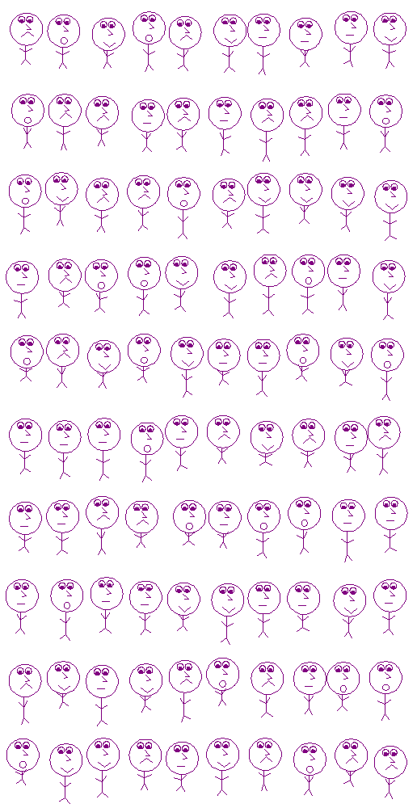

# Assignment 3: Practice with Loops

Create a file called `a3.py` on your computer with the following at the top:

```python
# a3.py

#
# Full Name:
# SFU Email:
#
```

Answer each of the questions below and put the requested functions into
`a3.py`. Please use *exactly* the name and list of parameters given in the
question.

When you're done, create a .zip file named `a3.zip` that contains *just* these
two files: `a2.py` (from assignment 2, needed for question 6 onward) and your
finished `a3.py`. Then submit `a3.zip` on
[Canvas](https://canvas.sfu.ca/courses/73212).


## Question 1: ask_int1

Here's a Python function that checks if a variable can be converted to an
`int`. Please cut-and-paste it into the top of your `a3.py` file:

```python
def is_int(n):
    """ Returns True of n is an int, and False otherwise.

    >>> is_int('5')
    True
    >>> is_int('5.6')
    False
    """
    try:
        int(n)
        return True
    except ValueError:
        return False
```

You don't need to worry about `try`/`catch`, other than to know it's how
Python handles errors (such as not being able to convert a string to an
`int`).

Using `is_int`, write a function called `ask_int1(prompt)` that prints the
string `prompt` on the screen and then reads an `int` typed by the user. If
the user types an invalid `int`, then `ask_int1` prints the prompt and asks
again. It keeps asking until the user enters a valid `int`.

For example:

```
>>> ask_int1('How old are you? ')
How old are you? ten
How old are you? 3.4
How old are you? 20
20
```


## Question 2: ask_int2

Write a function called `ask_int2(prompt)` that works the same as `ask_int1`,
but when the user is asked to re-type an answer it prints the more helpful
"Sorry ..." message shown in the example:

```
>>> ask_int2('How old are you? ')
How old are you? ten
Sorry, I don't know what int "ten" is. Please try again.
How old are you? 3.4
Sorry, I don't know what int "3.4" is. Please try again.
How old are you? 20
20
```

Make the "Sorry ..." message exactly the same as in the examples.


## Question 3: ask_int_between

Write a function called `ask_int_between(lo, hi)` that works similarly to
`ask_int1`, and returns an `int` entered by the user that is in the range `lo`
to `hi`. `lo` is the lowest possible value, and `hi` is the highest possible
value. You can assume that `lo` is less than, or equal to, `hi`.

If the user enters an invalid number, then, as shown, print the error message
and ask them to try again.

If the user enters a valid `int` that is either less then `lo` or greater than
`hi`, then print the error messages that are shown and ask them to try again.

For example:

```
>>> ask_int_between(3, 8)
Please enter a number from 3 to 8: two
Please try again: I don't know what int "two" is.
Please enter a number from 3 to 8: 2
Please try again: 2 is too low.
Please enter a number from 3 to 8: 15
Please try again: 15 is too high.
Please enter a number from 3 to 8: 8
8
```

## Question 4: Turtles love pentagons

The next few questions use turtle graphics, so add `import turtle` to the top
of `a3.py`.

Write a function called `pentagon_at(x, y, size)` that draws a regular
pentagon (i,e, a 5-sided polygon with all side lengths the same) whose
lower-left vertex is at position (`x`, `y`), and whose side-length is `size`.

Importantly, after the pentagon is drawn, the turtle should end up at the same
vertex, and facing in the *same* direction, as when it started.

For example:


## Question 5: A pentagonal flower

Write a function called `pentagonal_flower(x, y, size)` that does this:

- gets an `int` `n` from the user in the range 5 to 50 (use `ask_int_between`)
- draws `n` pentagons, each with side length `size`, such that the lower-left
  corner of each pentagon is at (`x`, `y`), and after each pentagon the turtle
  turns right `360/n` degrees
- when the pentagons are all drawn, the turtle is hidden

For example, here's a flower made of 25 pentagons:


## Question 6: Re-using a stick figure

Copy `a2.py `from the [assignment 2](../a2/a2.md) into your assignment 3
folder on your computer. Then in `a3.py`, add `import a2` to the top of the
file so you can call functions from `a2`, e.g. `a2.stick_figure(10)`.

Write a function (in `a3.py`) called `draw_figure(size)` that calls the
`stick_figure` function from `a2.py` to draw a stick figure of the given size.

**Note** If you didn't do [assignment 2](../a2/a2.md), then please do it! If
the `stick_figure` function has bugs or doesn't work the way you like, please
update it so it works correctly with this assignment.


## Question 7: A row of stick figures

Write a function called `figure_row(x, y, n)` that draws a *horizontal* line
of exactly `n` stick figures. Draw the first stick figure at (`x`, `y`), and
the others to the right of it at equally-spaced intervals. The figures should
*not* overlap in any way, and should *not* go off the screen.

Note that there is no `size` parameter pass to `figure_row`. Draw stick
figures of size so at least 10 of them can fit on the screen without going off
the screen.

For example, here's a row of 10 stick figures:


## Question 8: An array of stick figures

Write a function called `figure_grid(x, y, r, c)` that draws a rectangular
array consisting of `r` rows each containing `c` stick figures (drawn using
`figure_row`). Each row should be drawn at regularly spaced intervals, and no
figures should overlap or go off the screen.

Draw the figures at a size that allows for at least 5 rows and 10 figures per
row, with no figure going off the screen.

For example, here's a 10 by 10 grid of stick figures:




## Marking Scheme

**2 marks** each for questions 1 to 8 (a total of 16 marks)

**2 marks** Overall: consistent indentation and spacing (all blank lines and
spaces should have a good reason for being there)

**1 mark** Overall: variable and function names are self-descriptive

**1 mark** Overall: all lines 100 characters, or less, in length
