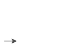
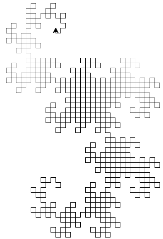
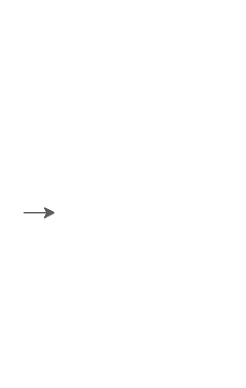
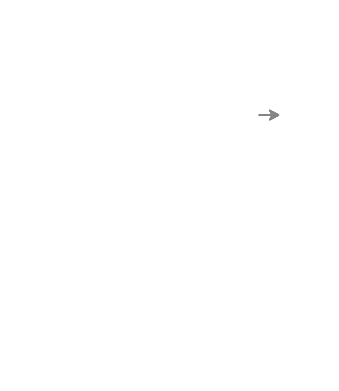

# Assignment 4: Tiny Turtle Programs

## Getting Started

Create a file called `a4.py` on your computer with the following at the top:

```python
# a4.py

#
# Full Name:
# SFU ID:
# SFU Email:
#
```

When you're done, submit your finished `a4.py` file on
[Canvas](https://canvas.sfu.ca/courses/73212).


## Question 1: A First Turtle Drawing Function

Create a function called `turtle_draw1(commands, step_size, turning_angle)`,
where `commands` is a string of turtle commands (described below), and
`step_size` and `turning_angle` are numbers. It works like this:

- The turtle pen starts down.
- For each character in `commands`:
	+ If the character is an `F`, then the turtle goes forward `step_size`
	  pixels.
	+ If the character is an `L`, then the turtle turns left `turning_angle`
	  degrees.
	+ If the character is an `R`, then the turtle turns right `turning_angle`
	  degrees.
	+ *Every* other character is ignored. No error messages are printed.

For example, this draws a rectangle:

```python
turtle_draw1('FF L FFFF L FF L FFFF', 50, 90)
```


By changing the step or angle, the same string can give a different drawing:

```python
turtle_draw1('FF L FFFF L FF L FFFF', 25, 120)
```




## Question 2: A Second Turtle Drawing Function

Create a function called `turtle_draw2(commands, step_size, turning_angle)`
that does everything `turtle_draw1` does, and, in addition, handles these
characters in the command string:

- If the character is a `G`, then the turtle goes forward `step_size`
  pixels. `G` and `F` do exactly the same thing.
- If the character is a `+`, then the turtle turns left `turning_angle`
  degrees. `+` and `L` do exactly the same thing.
- If the character is a `-`, then the turtle turns right `turning_angle`
  degrees. `-` and `R` do exactly the same thing.

As with `turtle_draw1`, every other character is ignored (with *no* error
messages printed).

For example, this draws exactly the same rectangle as in the previous
question:

```python
turtle_draw2('FF L FFFF L FF L FFFF', 50, 90)
```


And the same string but with different step and angle:

```python
turtle_draw2('FG L FGGF - FF - FFFG', 25, 120)
```


**Note** Having two different letters for the same command is useful for
drawing certain [L-systems](https://en.wikipedia.org/wiki/L-system), such as
the dragon curve below.


## Question 3: A Third Turtle Drawing Function

Finally, create a function called `turtle_draw3(commands, step_size,
turning_angle)` that does everything `turtle_draw2` does, and, in addition,
handles these characters in the command string:

- If the character is a `U`, then the turtle lifts up its pen (so it no line
  is drawn when when it moves).
- If the character is a `D`, then the turtle puts down its pen (so a line *is*
  drawn when it moves).
- If the character is a `C`, then the turtle screen is *cleared* by calling
  `turtle.clear()`. The turtle's position and heading are the same before and
  after.
- If the character is a `*`, then the turtle screen is *reset* by calling
  `turtle.reset()`. Resetting clears the screen and puts the turtle in the
  center facing east.

The `C` and `*` commands are useful for clearing the screen in interactive
turtle drawings. Please test your function with this:

```python
def interactive_draw():
    step_size = float(input('What is the step size? '))
    turning_angle = float(input('What is the turning angle? '))
    while True:
        commands = input('turtle> ')
        turtle_draw3(commands, step_size, turning_angle)
```

**Note** The Mu editor may hide the drawing screen when you run this function,
in which case you'll need to move the editor window to see it.


## Question 4: Enter the Dragon

The [dragon curve](https://en.wikipedia.org/wiki/Dragon_curve) is an example
of a [fractal curve](https://en.wikipedia.org/wiki/Fractal_curve). We can draw
it like this:

```python
def dragon_rule(commands):
	# ... you write the code ...

def repeat_rule(n, rule, start):
    result = start
    for i in range(n):
        result = rule(result)
    return result


order = 10
commands = repeat_rule(order, dragon_rule, 'F')

# tracer turned off to draw as quickly as possible
turtle.Screen().tracer(0)
turtle_draw3(commands, 10, 90)
turtle.Screen().update()
```



Because 10 was passed to `repeat_rule`, this is the **order 10 dragon curve**.
Here is an order 7 dragon curve:

```
order = 7
commands = repeat_rule(order, dragon_rule, 'F')
turtle.speed(0)
turtle_draw3(commands, 10, 90)
```


**Be careful**: the command strings increase in size exponentially, so orders
much bigger than 10 can create gigantic strings that can slow down, or even
crash, your computer.

Your task is to write the body of the `dragon_rule` function. `commands` is a
string of turtle commands, and `dragon_rule` returns a new string based in it.
It goes through the characters in `commands`, one at time, and creates a new
result string (using the accumulation pattern) following these rules:

- If the character is an `F`, then append `F+G` to the result string.
- If the character if a `G`, then append `F-G` to the result string.
- For any other character, append it unchanged to the result string.

```
>>> dragon_rule('F')
'F+G'
>>> dragon_rule('F+G')
'F+G+F-G'
>>> dragon_rule('F+G+F-G')
'F+G+F-G+F+G-F-G'
```

Make sure to test your `dragon_rule` function by calling it with the code
given at the start of this question.


## Question 5: Turtle Lists

A limitation of the turtle commands strings is they don't include the step
size or turning angle. So, lets include them by defining a **turtle list** as
a Python list formatted like this:

```python
[step_size, turning_angle, turtle_commands]
```

In particular:

- it's a list
- it's length is exactly 3
- `step_size` is a `float` or `int` that is greater than 0, representing the
  *step size* for the string of turtle commands
- `turning_angle` is *any* `float` or `int`, representing the *turning angle*
  for the string of turtle commands
- `turtle_commands` is *any* string; normally it will be a string of turtle
  commands that you would give to a function like `turtle_draw3`

Create a function called `is_turtle_list(x)` that returns `True` just when `x`
is a turtle list, and `False` otherwise.

For example:

```
>>> is_turtle_list([1, 2, 'FF'])
True
>>> is_turtle_list([25, 120, 'FF L FFFF L FF L FFFF'])
True
>>> is_turtle_list([40.33, -29.3, 'any string works'])
True
>>> is_turtle_list([40.33, -29.3, ''])
True

>>> is_turtle_list([-1, 2, 'FF'])
False
>>> is_turtle_list([1, 'FF'])
False
>>> is_turtle_list([1, 2, 'FF', 'FLFF'])
False

>>> is_turtle_list([1, 'FF'])
False
>>> is_turtle_list(['FF'])
False
>>> is_turtle_list('FF')
False

>>> is_turtle_list([])
False
>>> is_turtle_list([])
False
```

**Hints** You can use this function in your answer if you like:

```python
def is_num(x):
    """Returns True if x is a float or an int, and False otherwise.
    """
    return type(x) == float or type(x) == int
```

Remember that lines must be 100 characters in assignments. In Python you can
split a long line into multiple lines with the `\` character:

```python
def is_num(x):
    """Returns True if x is a float or an int, and False otherwise.
    """
    return type(x) == float  \
        or type(x) == int
```


## Question 6: Drawing a Turtle List

Create a function called `turtle_draw_list(lst)`, that draws the turtle
commands in `lst` using `turtle_draw3`, with the step size and turning angle
given in `lst`. If `lst` is not a valid turtle list, then it does nothing
except print a friendly and helpful error message.

For example:

```python
turtle_list = [50, 90, 
               'FF L FFFF L FF L FFFF UFFFD FF L FFFF L FF L FFFF'
              ]
```

Calling `turtle_draw_list(turtle_list)` draws two rectangles:



Here's an example of calling it with an invalid turtle list:

```
>>> turtle_draw_list([1, 2, 3, 'FFLFF'])
error: [1, 2, 3, 'FFLFF'] is not a valid turtle list 
```

## Question 7: Dragon Lists

Create a function called `make_dragon_list(n, step_size)` that returns a
turtle list whose command string is the dragon curve returned by
`repeat_rule(n, dragon_rule, 'F')`.

For example:

```
>>> make_dragon_list(5, 50)
[5, 90, 'F+G+F-G+F+G-F-G+F+G+F-G-F+G-F-G+F+G+F-G+F+G-F-G-F+G+F-G-F+G-F-G']
```

Calling `turtle_draw_list(make_dragon_list(5, 50))` draws the order 5 dragon
curve:



## Marking Scheme

**2 marks** each for questions 1 to 7 (a total of 14 marks)

**2 marks** overall: consistent indentation and spacing (all blank lines and
spaces should have a good reason for being there)

**1 mark** overall: all variable and function names are self-descriptive

**1 mark** overall: the length of all lines are less than, or equal to, 100
characters
