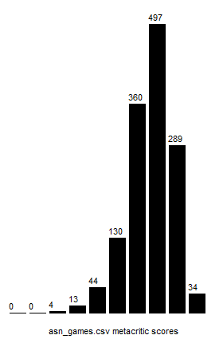

# Assignment 5: Game Data

This assignment explores [data
science](https://en.wikipedia.org/wiki/Data_science) using a dataset about
video games from [Steam](https://store.steampowered.com/).

Take a moment to browse [asn_games.csv](asn_games.csv). 

> **Note** On many computers, files that end with `.csv` are, by default,
> opened in Microsoft Excel. That's actually a pretty convenient way to view
> and process the data, and you can view that way if you like. However,
> [asn_games.csv](asn_games.csv) is a plain text file that is not specific to
> Excel. Depending upon your version of Mu, you may, or may not, be able to
> open a `.csv` in it. To work around this limitation, you could:
> 
> - Click the Load button on Mu, and then navigate to the correct folder.
>   Then type in the name of the file, [asn_games.csv](asn_games.csv). 
>   It should show the file in a Mu window. Python keywords (like
>   `and` and `or` will be hilighted, but just ignore that.
> - Open [asn_games.csv](asn_games.csv) another text editor (e.g. Notepad on
>   Windows, TextEdit on a Mac).

Each line contains information about one game, formatted as four [comma
separated values (CSV)](https://en.wikipedia.org/wiki/Comma-separated_values):

```
game-name, metacritic-score, recommendation-count, price
```

Where:

- `game-name` is the name of the game. There are no commas in game names, and
  so you can use the standard string `split` method to convert a line to a
  list of strings.
- `metacritic-score` is the game's [metacritic
  score](https://www.metacritic.com/), which is a popular way to rate a game's
  success. The metacritic scores should all be integers from 0 to 100.
- `recommendation-count` is the number of recommendations it has received on
  [Steam](https://store.steampowered.com/). This is an integer that is greater
  than, or equal to, 0.
- `price` is the game's cost. If the game is free, then the price is the
  string `free`. If it is not free, then it's a float (greater than 0) that
  starts with a `$` character. See the examples below.

For example, here's one line from [asn_games.csv](asn_games.csv):

```
Master of Orion, 74, 2104, $29.99
```

The game's named is "Master of Orion", it has a [metacritic
score](https://www.metacritic.com/) of 74, it has 2104
[Steam](https://store.steampowered.com/) recommendations, and costs $29.99.

Here's an example of a free game (note the different format for the price):

```
Evolve Stage 2, 77, 35278, free
```


### Important

**The only library you can import is turtle (for question 6)**. No other
imports are allowed. While Python has a module for
[CSV](https://en.wikipedia.org/wiki/Comma-separated_values) processing, and
there are excellent related tools and libraries (such as
[Pandas](https://pandas.pydata.org/) and [Jupyter
notebook](https://jupyter.org/)) designed specifically for data science, we
want you to stick to plain Python in this assignment.


## How Your Code Will be Marked

Test all the code your write for this assignment on
[asn_games.csv](asn_games.csv).

When marking your code, the markers will judge its correctness by running it
on a *different* [CSV](https://en.wikipedia.org/wiki/Comma-separated_values)
file that is formatted just like [asn_games.csv](asn_games.csv). The games
will be different, and the number of games could be different. So make sure
your code works for *any*
[CSV](https://en.wikipedia.org/wiki/Comma-separated_values) file formatted
like [asn_games.csv](asn_games.csv).

[asn_games.csv](asn_games.csv) and this other file were created by randomly
splitting one large file into two files.


## Getting Started

Create a file called `a5.py` on your computer with the following at the top
(and fill in your personal info):

```python
# a5.py

#
# Full Name:
#    SFU ID:
# SFU Email:
#

import turtle  # this is the only module you can import!
```

Remember, **turtle is the only import that is allowed** for this assignment.

When you're done, submit your finished `a5.py` file on
[Canvas](https://canvas.sfu.ca/courses/73212).


## General Assumption

For all the questions that ask for a file called `fname` as input, assume that
`fname` names a properly formatted
[CSV](https://en.wikipedia.org/wiki/Comma-separated_values) file of games,
like [asn_games.csv](asn_games.csv).

For this assignment, it's okay if your functions crash if `fname` doesn't
actually exist on disk, or contains data that is incorrectly formatted.


## Question 1

### Part 1.a

Write a function called `get_num_lines(fname)` that returns (*not* prints!) the
number of lines in a game
[CSV](https://en.wikipedia.org/wiki/Comma-separated_values) file. For example:

```
>>> get_num_lines('asn_games.csv')
7574 
```

### Part 1.b

Using `get_num_lines`, write a function called `print_num_games(fname)` that
prints (*not* returns!) the number of games in `fname`:

```
>>> print_num_games('asn_games.csv')
asn_games.csv has 7574 games
```

**Note** If you are having trouble opening/reading the file, make absolutely
sure that you are spelling the file name correctly, and that the both a5.py and
[asn_games.csv](asn_games.csv) are in the same folder.

You can check which folder you are in using Python's `os.getcwd()` and
`os.lisrdir` functions to check what folder Python is reading:

```
>>> import os
>>> os.getcwd()
'C:\\Users\\username\\courses\\120\\a5'

>>> os.listdir(os.getcwd())
['a5.py', 'asn_games.csv', 'small_games.csv']
```

`getcwd` is short for "get current working directory". Folders and directories
are the same thing.


## Question 2

Write a function called `split_game_line(csv_line)` that converts a string
formatted as in [asn_games.csv](asn_games.csv) into a list of values. This will
be very useful in the following questions.

It works like this:

```python
>>> csv_line = 'Master of Orion, 74, 2104, $29.99'
>>> split_game_line(csv_line)
['Master of Orion', 74, 2104, 29.99]

>>> csv_line = 'Half-Life 2: Lost Coast, 0, 4352, free'
>>> split_game_line(csv_line)
['Half-Life 2: Lost Coast', 0, 4352, 0.0]
```

`split_game_line` always returns a list of exactly 4 values:

- the first value is the name of the game, a string
- the second value is the metacritic score, an integer (not a string!)
- the third value is the recommendation count, an integer (not a string!)
- the fourth value is the price, a float (not a string)

If the price of a game is `'free'`, then it should be returned as a 0.0 in the
list (as in the example above).

**Hint** If you have unwanted spaces at the beginning or end of a string, you
could use one of the string `strip` methods to remove them.


## Question 3

Here's a function that prints (not returns!) all games with the highest
[metacritic score](https://www.metacritic.com/). Multiple games could tie for
the highest score, so the results are printed as a list:

```python
def print_highest_metacritic_score(fname):
    data = open(fname)
    max_meta = -1
    max_names = []
    for line in data:
        value = split_game_line(line)
        name = value[0]
        metacritic = value[1]
        if metacritic > max_meta:
            max_names = [name]
            max_meta = metacritic
        elif metacritic == max_meta:
            max_names.append(name)
    
    max_names.sort()

    print(f'These are the highest scoring metacritic games.')
    print(f'They each have a metacritic score of {max_meta}.')
    for name in max_names:
        print(f'  {name}')
    print()
```

For example:

```python
>>> print_highest_metacritic_score('asn_games.csv')
These are the highest scoring metacritic games.
They each have a metacritic score of 96.
  BioShock(tm)
  Grand Theft Auto V
  Half-Life
  Half-Life 2
```

### Part 3.a

Write a function called `print_most_recommendations(fname)` that prints (not
returns!) all the games with the highest number of recommendations, formatted
like this:

```
>>> print_most_recommendations('asn_games.csv')
These games have the most recommendations.
They each have 383949 recommendations.
  Team Fortress 2
```

In this example a single game has the most recommendations, but in general there
could be multiple games that tie for the most.

### Part 3.b

Write a function called `print_highest_price(fname)` that prints (not returns!)
the game(s) with the highest price, formatted like this:

```
>>> print_highest_price('asn_games.csv')
These games have the highest price.
They each cost $449.99.
  SolidFace Parametric CAD Modeler 2D/3D
```

In this example a single game has the highest price, but in general there could
be multiple games that tie for highest price.


## Question 4

Here's a function that returns (not prints!) the average [metacritic
score](https://www.metacritic.com/) of the games in `fname` that have a score
higher than 0 (0-scoring games are ignored):

```python
def get_metacritic_average(fname):
    """Returns the average metacritic score for games in fname.            
    IMPORTANT: Games with a metacritic score of 0 are **not** include in the
    average. They are treated as if they were not in the file.
    """
    data = open(fname)
    count = 0
    total = 0
    for line in data:
        value = line.split(',')
        name = value[0]
        meta = int(value[1])
        if meta > 0:
            total += meta
            count += 1
    return total / count
```

For example:

```
>>> get_metacritic_average('asn_games.csv')
72.19474835886214
```

### Part 4.a

Write a function called `get_recommendation_average(fname)` that returns (not
prints!) the average number of recommendations for all games in `fname` that
have more that have more than 0 recommendations (games with 0 recommendations
are ignored). 

For example:

```
>>> get_recommendation_average('asn_games.csv')
2861.0464490070685
```

### Part 4.b

Write a function called `get_price_average(fname)` that returns (not prints!)
the average price of all the games in `fname`. This time, free games *are*
included in the average. Free games are treated as if their price was 0.0.

For example:

```
>>> get_price_average('asn_games.csv')
9.244562978610753
```

## Question 5

### Part 5.a

Write a function called `get_game_dict(fname)` that returns (not prints!) a
*dictionary* of all the game names in `fname`. The dictionary keys are the names
of the games, and the corresponding values are the number of times that name
appears as the name of game. Make sure there are no extra whitespace characters
at the beginning or end of the names.

For example, [small_games.csv](small_games.csv) contains these games:

```
Pong, 12, 102, 0.25
Asteroids, 75, 5093, 0.50
Pong, 12, 102, 0.25
Pac Man, 88, 12495, 0.25
Ms Pac Man, 58, 803, 0.25
Asteroids, 85, 9600, 0.50
Pong, 11, 102, 0.25
```

Running `get_game_dict` on it returns (not prints!) this:

```
>>> get_game_dict('small_games.csv')
{'Pong': 3, 'Asteroids': 2, 'Pac Man': 1, 'Ms Pac Man': 1}
```

Note that it's possible that the *order* of the *key*:*value* pairs might be
different than the example. It's okay if yours are in a different order, as long
as all the same keys and values are the same.


### Part 5.b

Use `get_game_dict` to help write a function called `print_duplicates1(fname)`
that prints a list of duplicate game names as shown. The order of the names
doesn't matter.

For example:

```
>>> print_duplicates1('small_games.csv')
Pong
Asteroids
```

Or:

```
>>> print_duplicates1('asn_games.csv')
Batman: Arkham Asylum Game of the Year Edition
RIP - Trilogy(tm)
BRINK
Jewel Quest Pack
Darksiders(tm)
Warhammer 40000: Dawn of War II: Retribution
Gumboy - Crazy Adventures(tm)
F.E.A.R.
HITMAN(tm)
Civilization IV(r): Warlords
Shank
Call of Duty(r): Modern Warfare(r) 3
Mahjong Quest Collection
Westward Collection
Tropico Reloaded
DeathSpank
Assassins Creed 2 Deluxe Edition
Civilization IV: Beyond the Sword
Call of Duty(r): Ghosts
SiN Episodes: Emergence
Portal 2
Tom Clancys Rainbow Six(r) Siege
Cake Mania Collection
Call of Duty(r): Black Ops III
Crysis Warhead(r)
Counter-Strike: Condition Zero
Rise
Portal
Gear Up
Tradewinds Caravans + Odyssey Pack
Super Granny Collection
Train Simulator 2016
Fallout: New Vegas
Painkiller: Black Edition
Alpha Protocol(tm)
Dark Messiah of Might & Magic
Stronghold HD
Krosmaster Arena
Arma 2
Call of Duty(r): Modern Warfare(r) 2
Crazy Machines 1.5
The Sims(tm) 3
Jagged Alliance 2 Gold
Tradewinds Classics
```

### Part 5.c

Use `get_game_dict` to help write a function called `print_duplicates2(fname)`
that prints a list of duplicate game names that are *numbered* and *sorted
alphabetically*, as shown.

For example:

```
>>> print_duplicates2('small_games.csv')
1. "Asteroids" is a duplicate
2. "Pong" is a duplicate
```

Notice that the names are printed in "-quotes.

Or:

```
>>> print_duplicates2('asn_games.csv')
1. "Alpha Protocol(tm)" is a duplicate
2. "Arma 2" is a duplicate
3. "Assassins Creed 2 Deluxe Edition" is a duplicate
4. "BRINK" is a duplicate
5. "Batman: Arkham Asylum Game of the Year Edition" is a duplicate
6. "Cake Mania Collection" is a duplicate
7. "Call of Duty(r): Black Ops III" is a duplicate
8. "Call of Duty(r): Ghosts" is a duplicate
9. "Call of Duty(r): Modern Warfare(r) 2" is a duplicate
10. "Call of Duty(r): Modern Warfare(r) 3" is a duplicate
11. "Civilization IV(r): Warlords" is a duplicate
12. "Civilization IV: Beyond the Sword" is a duplicate
13. "Counter-Strike: Condition Zero" is a duplicate
14. "Crazy Machines 1.5" is a duplicate
15. "Crysis Warhead(r)" is a duplicate
16. "Dark Messiah of Might & Magic" is a duplicate
17. "Darksiders(tm)" is a duplicate
18. "DeathSpank" is a duplicate
19. "F.E.A.R." is a duplicate
20. "Fallout: New Vegas" is a duplicate
21. "Gear Up" is a duplicate
22. "Gumboy - Crazy Adventures(tm)" is a duplicate
23. "HITMAN(tm)" is a duplicate
24. "Jagged Alliance 2 Gold" is a duplicate
25. "Jewel Quest Pack" is a duplicate
26. "Krosmaster Arena" is a duplicate
27. "Mahjong Quest Collection" is a duplicate
28. "Painkiller: Black Edition" is a duplicate
29. "Portal" is a duplicate
30. "Portal 2" is a duplicate
31. "RIP - Trilogy(tm)" is a duplicate
32. "Rise" is a duplicate
33. "Shank" is a duplicate
34. "SiN Episodes: Emergence" is a duplicate
35. "Stronghold HD" is a duplicate
36. "Super Granny Collection" is a duplicate
37. "The Sims(tm) 3" is a duplicate
38. "Tom Clancys Rainbow Six(r) Siege" is a duplicate
39. "Tradewinds Caravans + Odyssey Pack" is a duplicate
40. "Tradewinds Classics" is a duplicate
41. "Train Simulator 2016" is a duplicate
42. "Tropico Reloaded" is a duplicate
43. "Warhammer 40000: Dawn of War II: Retribution" is a duplicate
44. "Westward Collection" is a duplicate
```

### Part 5.d

Finally, use `get_game_dict` to help write a function called
`print_duplicates3(fname)` that prints a list of duplicate game names that are
*numbered*, *sorted alphabetically*, and also *show how many times they occur in
the file*. Format the output as shown.

For example:

```
>>> print_duplicates3('small_games.csv')
1. "Asteroids" occurs 2 times
2. "Pong" occurs 3 times
```

All the listed games occur at least 2 times. Notice that the names are printed
in "-quotes.

Or:

```
>>> print_duplicates3('asn_games.csv')
1. "Alpha Protocol(tm)" occurs 2 times
2. "Arma 2" occurs 3 times
3. "Assassins Creed 2 Deluxe Edition" occurs 2 times
4. "BRINK" occurs 3 times
5. "Batman: Arkham Asylum Game of the Year Edition" occurs 3 times
6. "Cake Mania Collection" occurs 3 times
7. "Call of Duty(r): Black Ops III" occurs 3 times
8. "Call of Duty(r): Ghosts" occurs 2 times
9. "Call of Duty(r): Modern Warfare(r) 2" occurs 2 times
10. "Call of Duty(r): Modern Warfare(r) 3" occurs 3 times
11. "Civilization IV(r): Warlords" occurs 3 times
12. "Civilization IV: Beyond the Sword" occurs 3 times
13. "Counter-Strike: Condition Zero" occurs 2 times
14. "Crazy Machines 1.5" occurs 2 times
15. "Crysis Warhead(r)" occurs 3 times
16. "Dark Messiah of Might & Magic" occurs 2 times
17. "Darksiders(tm)" occurs 2 times
18. "DeathSpank" occurs 2 times
19. "F.E.A.R." occurs 4 times
20. "Fallout: New Vegas" occurs 2 times
21. "Gear Up" occurs 2 times
22. "Gumboy - Crazy Adventures(tm)" occurs 2 times
23. "HITMAN(tm)" occurs 2 times
24. "Jagged Alliance 2 Gold" occurs 3 times
25. "Jewel Quest Pack" occurs 3 times
26. "Krosmaster Arena" occurs 2 times
27. "Mahjong Quest Collection" occurs 3 times
28. "Painkiller: Black Edition" occurs 2 times
29. "Portal" occurs 2 times
30. "Portal 2" occurs 2 times
31. "RIP - Trilogy(tm)" occurs 2 times
32. "Rise" occurs 2 times
33. "Shank" occurs 2 times
34. "SiN Episodes: Emergence" occurs 3 times
35. "Stronghold HD" occurs 3 times
36. "Super Granny Collection" occurs 4 times
37. "The Sims(tm) 3" occurs 2 times
38. "Tom Clancys Rainbow Six(r) Siege" occurs 4 times
39. "Tradewinds Caravans + Odyssey Pack" occurs 3 times
40. "Tradewinds Classics" occurs 2 times
41. "Train Simulator 2016" occurs 5 times
42. "Tropico Reloaded" occurs 3 times
43. "Warhammer 40000: Dawn of War II: Retribution" occurs 2 times
44. "Westward Collection" occurs 3 times
```

## Question 6

Create a function called `def draw_histogram(fname)` that draws a
[histogram](https://en.wikipedia.org/wiki/Histogram) of the metacritic scores in
`fname`.

The metacritic scores range from 0 to 100. For this question, **ignore all games
that have a metacritic score of 0** (don't include them in the histogram).

Also, **don't remove duplicate games**. Leave them in. This might make the data
a little less accurate, but it simplifies the question.

Your histogram should consist of exactly 10 rectangles, each representing the
count of how many games are in a range of metacritic scores. The ranges are:

    0  < rectangle 1  <= 10
    10 < rectangle 2  <= 20
    20 < rectangle 3  <= 30
    30 < rectangle 4  <= 40
    40 < rectangle 5  <= 50
    50 < rectangle 6  <= 60
    60 < rectangle 7  <= 70
    70 < rectangle 8  <= 80
    80 < rectangle 9  <= 90
    90 < rectangle 10 <= 100

For example, rectangle 7 represents the number of games whose metacritic score
is greater than 60, and less than, or equal to, 70.

Again, games with a score of 0 are *not* counted.

As in the example below, at the top of each rectangle write the number of games.
Underneath the entire histogram, put a label saying what file the data is from.
Use the
[turtle.write](https://docs.python.org/3/library/turtle.html#turtle.write)
function to add text.

**You can assume that the maximum count for any metacritic score is 500**. So
make sure your histogram is entirely on the screen, and is as neatly drawn and
easy to read as in the example. Feel free to make yours look better, if you
like.

Here is the final histogram:



And the histogram being drawn:


## Marking Scheme

**Question 1**: **2 marks** (1 for each part)

**Question 2**: **2 marks**

**Question 3**: **2 marks** (1 for each part)

**Question 4**: **2 marks** (1 for each part)

**Question 5**: **3 marks** (1 for each part)

**Question 6**
- **1 mark** for neatly drawn and spaced rectangles that are proportionally
  correct
- **1 mark** for correct and readable counts on top of the rectangles
- **1 mark** for a correct and readable label under the histogram
- **1 mark** for the entire histogram being at least as neatly drawn and
  readable as the one in the example (or better!)

**2 marks** overall: consistent indentation and spacing (all blank lines and
spaces should have a good reason for being there)

**1 mark** overall: all variable and function names are self-descriptive

**1 mark** overall: the length of all lines are less than, or equal to, 100
characters
