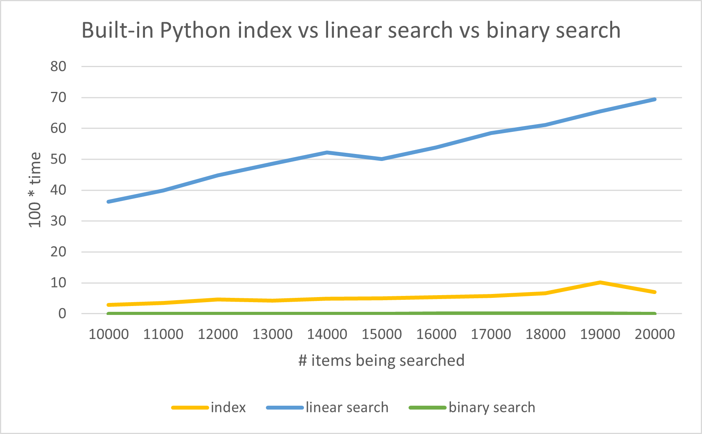
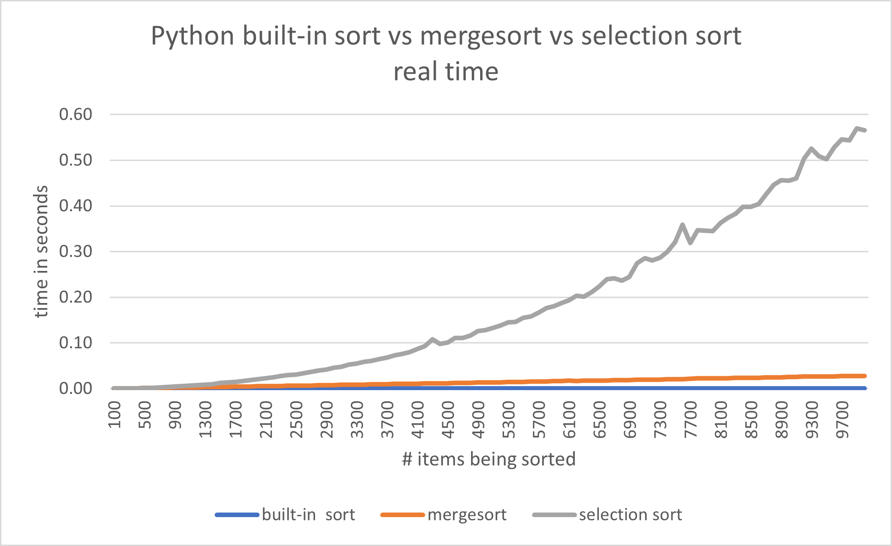

# Lecture 25 Notes

An **algorithm** is a finite sequence of precise instructions that solve a
computational problem. Algorithms are one of the key ideas in computer
science, so much so that you might even say that computer science is the study
of algorithms.

In general, we want algorithms that run quickly, don't use too much memory, and
are easy to debug and understand.

In what follows, we'll study two different problems: *searching* and
*sorting*. We'll see multiple ways to solve each of these problems.

Our implementations of searching and sorting won't be as efficient as they could
be. Instead, we focus on clarity and understanding. High-performance
implementations of searching and sorting require a lot more work and are
significantly more complex.

See [searching.py](searching.py) and [sorting.py](sorting.py) for the code used
in these notes.


## The Basic Search Problem

Suppose you have a list of values $$a_0, a_1, \ldots, a_{n-1}$$. We assume they
are all the same type, e.g. numbers, strings, letters, or lists --- *any* value
that can be compared with `==`. The **search problem** asks for an answer to
this question:

> What is the index position of an element on the list that is equal to a
> given target value $$x$$?

If the target value $$x$$ is nowhere on the list, then we want the search to
somehow signal that. For simplicity, we will do this by having it return the
value -1, i.e. -1 means "$$x$$ was not found".

If $$x$$ occurs more than once on the list, then we usually want the *first*,
i.e. *left-most* occurrence of $$x$$. If we want a different one, then we will
say that explicitly.

Lets look at some examples. Consider this list:

```
[3, 9, -2, 4, -2]`
```

If you want to find the position of the first -2, you can see that the
left-most -2 is at index location 2. If you want the position of 5, then the
result is -1 because 5 is *not* on the list.

Or suppose we have this list:

```
['car', 'ebike', 'foot', 'scooter']`
```

If you want to know the position of `'scooter'`, the search will tell you it's
at index location 3. If you want to know the position of `'bike'`, -1 is
returned because `'bike'` is *not* in the list.


### The Linear Search Algorithm

The **linear search** algorithm is the most basic and important answer to the
search problem. It's already implement with the built-in `index` list method:

```
>>> nums = [3, 9, -2, 4, -2]
>>> nums.index(-2)
2

>>> nums.index(5)
Traceback (most recent call last):
  File "__main__", line 1, in <module>
ValueError: 5 is not in list


>>> vehicles = ['car', 'ebike', 'foot', 'scooter']
>>> vehicles.index('scooter')
3

>>> vehicles.index('bike')
Traceback (most recent call last):
  File "__main__", line 1, in <module>
ValueError: 'bike' is not in list
```

Instead of returning -1 when it can't find the target value, the `index`
method causes a `ValueError` exception. In Python, exceptions are a
general-purpose way of signaling and handling errors, but we won't be covering
them in this course.

Let's implement our own version of linear search. First, we should think of
the *algorithm* to solve the problem. This isn't too hard for linear search.
To determine if one of the values $$a_0, a_1, \ldots, a_{n-1}$$ equals $$x$$,
we will check them one at time, starting with $$a_0$$, then $$a_1$$, then
$$a_2$$, and so on. Eventually we will find a value equal to $$x$$, or prove
that $$x$$ is not in the list

```python
def linear_search(x, lst):
    """Returns the position of the left-most x in lst.
    If x is not in lst, returns -1.
    lst is assumed to be a list of values. Order doesn't matter.
    """
    i = 0
    while i < len(lst):
        if lst[i] == x: # x found at location i
            return i 
        i += 1
    return -1           # x not in lst
```

For example:

```
>>> nums = [3, 9, -2, 4, -2]
>>> linear_search(-2, nums)
2
>>> linear_search(5, nums)
-1

>>> vehicles = ['car', 'ebike', 'foot', 'scooter']
>>> linear_search('scooter', vehicles)
3
>>> linear_search('bike', vehicles)
-1
```

**Important** For linear search, *it doesn't matter what order the elements in
the list are*. Linear works the same whether the values are, say, in sorted
order, or in a totally random order.


### The Reverse Linear Search Algorithm

Another way to solve the linear search problem is to check the elements of the
list going from right to left, i.e. by starting at the *end* of the list and
moving towards the start. We will call this **reverse linear search**. The
main difference between it and regular linear search is that when $$x$$ occurs
multiple times in the list then reverse linear search returns the position of
the *right-most* occurrence of $$x$$. Regular linear search returns the
left-most position.

Here's an implementation of reverse linear search:

```python
def reverse_linear_search(x, lst):
    """Returns the position of the right-most x in lst.
    If x is not in lst, returns -1.
    lst is assumed to be a list of values. Order doesn't matter.
    """
    i = len(lst) - 1
    while i >= 0:
        if lst[i] == x: # x found at location i
            return i 
        i -= 1
    return -1           # x not in lst
```

For example:

```
>>> nums = [3, 9, -2, 4, -2]
>>> reverse_linear_search(-2, nums)
4                                      # different result than regular linear search
>>> reverse_linear_search(5, nums)
-1

>>> vehicles = ['car', 'ebike', 'foot', 'scooter']
>>> reverse_linear_search('scooter', vehicles)
3
>>> reverse_linear_search('bike', vehicles)
-1
```

Reverse linear search can be useful in practice. Sometimes you might know
approximately where in the list the item you're searching for might be. If
it's probably near the *end* of the list, then reverse linear search might it
faster than regular linear search. For instance, it are searching for the
position of the `'.'` in a file name, it's probably faster to user reverse
linear search since the `'.'` tends to be near the end of the file name, e.g.
`story.txt`, `index.md`, `searching.py`, etc.

> **Aside** There are other ways you could do linear search. As long as you
> *check* all the items in the list, you can do that in any order that you
> like. For instance, you could:
> 
> - start in the middle, and then scan to the left, "wrapping-around" to the
>   start of the list when you hit the end
> - start in the middle and expand outwards in both left and right directions;
>   this will give you the value of $$x$$ that is closest to your starting point'
> - start at both the beginning and the end, and scan inwards towards the
>   middle from both directions
>   
> In practice, you'd only use one of these other methods if you had some
> reason to think they would find $$x$$ more quickly. If you know nothing about
> the order of the elements on the list, then just use regular linear search.


### The Binary Search Algorithm

The **binary search algorithm** solves the search problem in a very different
way. First, binary search requires that the list of elements be ascending
sorted order. Then, it works by checking the target value $$x$$ is equal to the
*middle* item on the list. If it is, then it's done. But otherwise it cuts the
list in half, depending on whether $$x$$ is smaller than or greater than the
middle element. It then applies binary search to this smaller half. It keeps
doing this until either it finds $$x$$, or the remaining list is empty.

It helps to trace through some examples by hand. For example, suppose you have
the list `[0, 2, 3, 4, 8, 9, 9]`, and you want to find the target value 5. The
list is in sorted order, so we can use binary search like this:

- First check if 5 is equal to the middle element of the list. 
- 4 is *not* equal to 5. So if 5 is in the list, it must be to the *left* of
  the 4, i.e. in the sub-list `[0, 2, 3]`.
- Next we check if 5 is equal to the middle element of `[0, 2, 3]`.
- 5 is not equal to 2, and so if 5 is in that list it must be to the right of
  2, i.e. in the sub-list `[3]`.
- Next we check if 5 is equal to the middle element of `[3]`.
- 5 is not equal to 3, and if 5 is in that list it must e to the right of the
  3, i.e. in the sub-list []. But there are no values in the empty list `[]`,
  so this proves that 5 is *not* in the list, and -1 can be returned.

Here is an implementation of binary search. It uses the variables `lo` and
`hi` to keep track of the current sub-list:

```python
def binary_search(x, lst):
    """Returns an index i such that list[i] == x.
    If x is not in lst, returns -1.
    lst must be in sorted order, from smallest to biggest.
    """
    lo = 0
    hi = len(lst) - 1
    while lo <= hi:
        mid = (lo + hi) // 2
        if lst[mid] == x:
            return mid    # x found at location mid
        elif x < lst[mid]:
            hi = mid - 1
        else: # lst[mid] < x
            lo = mid + 1
    return -1             # x not in lst
```

Binary search is notoriously tricky to implement. The idea is not difficult
once you understand it, but getting every little detail exactly right is not
so easy. So be sure to carefully test it!

See [searching.py](searching.py) for an implementation.


### Comparing Linear Search and Binary Search

How fast are linear search and binary search? Here's the results of an
experiment showing how their real time performance compares:



This shows clearly that are linear search is much slower than both the built-in
`index` and binary search. The linear search graph is not perfectly smooth since
the computer running the experiment is doing other things at the same time, and
occasionally it slows down or speeds up.

When computer scientists study algorithms theoretically, actual running time is
usually *not* a good way to measure performance. Actual running time depends too
much on the speed of the computer, and whatever else it might be doing at the
same time. Instead, computer scientists simplify things by choosing a **key
instruction** in the code, and then count how many times that instruction is
executed. If you choose a good key instruction, the resulting performance graphs
have the same shape as the actual running time graphs.

For searching and sorting algorithms, experience shows that *comparisons* are a
good key instruction. For linear search, we count how many times `==` is
executed, and for binary search we count how many times `<=` is executed.

So when we talk about the performance of linear search and binary search, we
mean *how many comparisons they do*.

Suppose you run `linear_search` on a list with 100 elements. Then:

- **Best case**: the *minimum* number of comparisons `linear_search` does is
  1, in the case where the first element is $$x$$
- **Worst case**: the *maximum* number of comparison `linear_search` does is
  100, either when $$x$$ is the last element, or not in the list at all
- **Average case**: the *average* number of comparisons `linear_search` does is
  about $$\frac{100}{2}=50$$, assuming randomly ordered data; the reason for
  this is that you will find $$x$$ using a couple of comparisons just as often
  as you will find $$x$$ using around 100 comparisons, and overall it's as if
  you are searching half-way through the list each time

In general, for $$n$$ items linear search does 1 comparison in the best case,
$$n$$ comparisons in the worst case, and about $$\frac{n}{2}$$ in the average
case.

In practice, it's wise to assume that linear search will always do the maximum
number of comparisons. The best case happens rarely (about a 1 in $$n$$ chance),
and the average and worst cases are much more common. So we just say linear
search does $$n$$ comparisons. Since the expression $n$ is a *linear
expression*, we also say that linear search is a **linear time** algorithm.

> We will follow the maxim "Hope for the best, but prepare for the worst".

Assuming your list is in sorted order, binary search usually does vastly fewer
comparisons than linear search. In general, if your list has $$n$$ items then
binary search performs like this:

- **Best case**: the *minimum* number of comparisons `binary_search` does is
  1, in the case where the middle element is $$x$$
- **Worst case**: the *maximum* number of comparison `binary_search` does is
  about $$\log_2 n$$
- **Average case**: the *average* number of comparisons `binary_search` does
  is about $$\log_2 n$$

To get an idea of how much better binary search is, look at this table:

| **n**    | **log2 n** |
|----------|------------|
|    16    |      4     |
|    32    |      5     |
|    64    |      6     |
|    128   |      7     |
| 1048576  |     20     |

1048576 is $$2^{20}$$, which is just over a million. If you have a sorted list
of a million strings, then, in the worst case, linear search would do 1048576
comparisons. But binary search would, in the worst case, only do about $$\log_2
1000000 \approx 20$$ comparisons. So if you have the choice, especially with
large amounts of data, you should always using binary search instead of linear
search.

See [searching.py](searching.py) for code that counts comparisons of linear and
binary search. There's also interest data and graphs in
[comparisons.xlsx](comparisons.xlsx), e.g.:


## The Basic Sorting Problem

Suppose you have a list of values $$a_0, a_1, \ldots, a_{n-1}$$. We assume all
they are all the same type, e.g. numbers, strings, letters, or lists --- *any*
value that can be compared with `<=`. The **sorting problem** asks for an answer
to this question:

> How can you re-arrange the values in the list so that they are in ascending
> order?

Python has a built-in sort function for lists that shows what this means:

```
>>> lst = [9, 3, 1, 4, 3]
>>> lst.sort()
>>> lst
[1, 3, 3, 4, 9]

>>> words = ['shell', 'nose', 'apple', 'tree', 'shoe']
>>> words.sort()
>>> words
['apple', 'nose', 'shell', 'shoe', 'tree']
```

Notice that the list is modified in-place, i.e. `sort` does *not* make a copy
and the original order of the list is lost. The algorithms we implement below
will, for simplicity, return a sorted copy.


### The Selection Sort Algorithm

Think for a moment how you would sort the numbers on this list:

```
[9, 3, 1, 4, 3]
```

One way to do it is like this:

- Pick out the smallest number, 1, and put it in a new list called `result`
- Pick out the next smallest number, 3, and append it to the end of `result`.
  There are two copies of 3, so do this once for each copy.
- Pick out the next smallest number, 4, and append it to the end of `result`.
- Finally, pick out the last number, 9, and append it to the end of `result`.

After these steps, `result` contains the numbers in sorted order.

This method of sorting is called **selection sort**, and we can implement it
like this in Python:

```python
def selection_sort(lst):
    result = []
    while len(lst) > 0:
        smallest = min(lst)
        result.append(smallest)
        lst.remove(smallest)
    return result
```

For example:

```
>>> selection_sort([9, 3, 1, 4, 3])
[1, 3, 3, 4, 9]

>>> selection_sort(['shell', 'nose', 'apple', 'tree', 'shoe'])
['apple', 'nose', 'shell', 'shoe', 'tree']
```


### The Mergesort Algorithm

Mergesort is a more efficient algorithm for sorting. In fact, Python's built-in
`sort` function is an optimized version of mergesort. 

The key idea of mergesort is to divide the list into two halves, sort each half
(recursively using mergesort!), and then *merge* the two sorted halves into a
single sorted list.

Here's how mergesort can be implemented in Python:

```python
import heapq

def merge(lst1, lst2):
    """Combines lst1 and lst2 into a new sorted list.
    lst1 and lst2 must both be in ascending sorted order.
    """
    return list(heapq.merge(lst1, lst2))   

def mergesort(lst):
    """Returns a copy of lst with its items re-arranged into ascending order.
    Uses mergesort.
    """
    n = len(lst)
    if n < 2:
        return lst[:]  # already sorted
    else:
        mid = n // 2
        left = lst[:mid]
        right = lst[mid:]
        left_sorted = mergesort(left)    # recursive call
        right_sorted = mergesort(right)  # recursive call
        return merge(left_sorted, right_sorted)
```

Start by reading the `mergesort` function. If the length of the list being
sorted is less than 2, then that list is already sorted and it returns the list
itself. For longer lists, it splits the list into two halves, recursively sorts
each half, and then merges the two haves together to form a new sorted list.

As you can guess from it's name, the `merge` function is an important part of
mergesort. Merging takes two *already-sorted* lists an combines them into a
single new sorted list. Since the lists are already sorted, it can do this much
more efficiently than sorting.

We uses Python's `heapq.merge` function to do the merging. See
[sorting.py](sorting.py) for another implementation of merge using loops and
if-statements. `heap.merge` doesn't return a list directly, but instead returns
the elements one at a time in sorted order. So we call `list` to get all the
elements in a list. It's similar `range(n)`, which returns the numbers 0 to n-1
one at a time, and you write `list(range(n))` if you want them all in a list.

Mergesort is **recursive**. That means that it calls itself in a couple of
places. Recursion can be a tricky topic to understand at first. We'll see more
examples of it later. For now, just know that a function can call itself, and
calling `mergesort` always returns a sorted list.


### Comparing Selection Sort and Mergesort

In practice, mergesort is much faster than selection sort. You can see it in
this graph of their running times (with the built-in sort included):



The graph shows that selection sort is *much* slower than both mergesort and
Python's built-in sort. The built-in sort is significantly faster than our
mergesort, which is reasonable given that the built-in sort was designed to be
extremely fast.

The selection sort graph is interesting. It's basic shape is a *parabola*, i.e.
a quadratic curve. While we won't go into the details here, the running time of
selection sort is proportional to $$n^2$$, where $$n$$ is the number of items
being sorted. Since $$n^2$$ is a quadratic expression, we say that selection
sort runs in **quadratic time**, i.e. the running time is proportional to the
*square* of the number of elements being sorted.

Notice that selection sort's graph is not smooth. It wiggles up and down a bit
because of randomness in the times. This is because the computer occasionally
does other things while running Python, e.g. it might receives email, save a
file in the background, be running a video, etc. These other operations can slow
down the sorting a little bit in ways that are hard to predict, but show up as
wiggles in the graph.

Mergesort (and the built-in sort) both run in time proportional to $$n \log_2
n$$, where $$n$$ is the number of items being sorted. When $$n$$ is large, this
is *much* less than $$n^2$$, and so mergesort is usually much faster than
selection sort. In practice, the performance is different that there are very
few cases where you would selection sort to mergesort. Indeed, in Python the
built-in sort is almost always the best choice.

See [comparisons.xlsx](comparisons.xlsx) for all the data.
